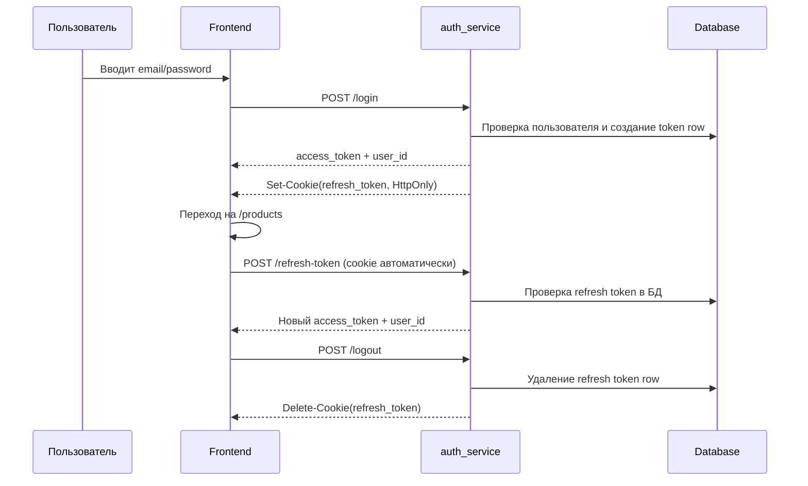

# Авторизация и сессия

Ниже описано, как сейчас работает авторизация в `auth_service` и как приложение восстанавливает состояние пользователя после обновления страницы.

## Ключевая идея

Система не использует классическую серверную сессию в cookie. Вместо этого она работает по схеме `access token + refresh token`:

- `access_token` нужен для обычных запросов к защищенным API.
- `refresh_token` нужен только для получения нового `access_token`.
- `refresh_token` хранится в `HttpOnly` cookie, поэтому JavaScript его не видит.
- Текущий `user_id` хранится только в памяти страницы и восстанавливается из ответа сервера.

Источники:

- [auth_service/app/routes.py](/Users/metaf/Dev/git/StoreSystem-app/auth_service/app/routes.py)
- [auth_service/app/auth.py](/Users/metaf/Dev/git/StoreSystem-app/auth_service/app/auth.py)
- [auth_service/static/js/auth.js](/Users/metaf/Dev/git/StoreSystem-app/auth_service/static/js/auth.js)
- [auth_service/static/js/form_login.js](/Users/metaf/Dev/git/StoreSystem-app/auth_service/static/js/form_login.js)

## Что где хранится

- `access_token`:
  - живет 30 минут;
  - выдается сервером после логина и после refresh;
  - кэшируется во фронтенде только в памяти страницы (`cachedAccessToken`);
  - не сохраняется в `localStorage`.
- `refresh_token`:
  - живет до 7 дней;
  - хранится в таблице `Token` в БД;
  - также ставится в `HttpOnly` cookie;
  - при `remember me = false` cookie становится сессионной;
  - при `remember me = true` cookie получает `max_age` на 7 дней.
- `user_id`:
  - приходит из JWT payload (`sub`);
  - на фронте хранится только в памяти страницы (`cachedUserId`);
  - больше не используется как постоянное состояние в `localStorage`.

## Как проходит логин

1. Пользователь вводит `email`, `password` и, при необходимости, ставит `remember me`.
2. Фронт отправляет `POST /login` с телом:
   - `email`
   - `password`
   - `remember_me`
3. Сервер:
   - ищет пользователя по `email`;
   - проверяет пароль;
   - создает пару токенов через `create_tokens(...)`;
   - удаляет старые токены этого пользователя из БД;
   - возвращает `access_token` и `user_id` в JSON;
   - ставит `refresh_token` в cookie.
4. Фронт после успешного ответа перенаправляет пользователя на `/products`.

См.:

- [auth_service/app/routes.py](/Users/metaf/Dev/git/StoreSystem-app/auth_service/app/routes.py#L129)
- [auth_service/app/auth.py](/Users/metaf/Dev/git/StoreSystem-app/auth_service/app/auth.py#L18)
- [auth_service/app/schemas.py](/Users/metaf/Dev/git/StoreSystem-app/auth_service/app/schemas.py#L67)

## Как восстанавливается доступ после reload

После обновления страницы JavaScript уже не может опираться на старый `access_token`, потому что он не лежит в `localStorage`.

### Порядок восстановления

1. Страница вызывает `getTokenFromDatabase()`.
2. Если в памяти уже есть `cachedAccessToken`, фронт проверяет его через `POST /verify-token`.
3. Если токен невалиден или его нет, фронт вызывает `POST /refresh-token` с `credentials: "include"`.
4. Сервер читает `refresh_token` из cookie.
5. Сервер проверяет:
   - JWT refresh token;
   - запись в таблице `Token`;
   - срок действия refresh token.
6. Если refresh валиден, сервер выдает новый `access_token` и `user_id`.
7. Фронт кладет их только в память страницы:
   - `cachedAccessToken`
   - `cachedUserId`
8. Если refresh не удался, пользователь перенаправляется на `/login`.

См.:

- [auth_service/static/js/auth.js](/Users/metaf/Dev/git/StoreSystem-app/auth_service/static/js/auth.js#L9)
- [auth_service/app/routes.py](/Users/metaf/Dev/git/StoreSystem-app/auth_service/app/routes.py#L43)
- [auth_service/app/auth.py](/Users/metaf/Dev/git/StoreSystem-app/auth_service/app/auth.py#L80)

## Как работают защищенные запросы

Почти все страницы и сценарии перед обращением к API сначала вызывают `getTokenFromDatabase()`.

После этого запросы уходят с заголовком:

```http
Authorization: Bearer <access_token>
```

Сервер проверяет токен через `verify_token(...)`:

- JWT должен корректно декодироваться;
- `sub` должен соответствовать пользователю;
- токен должен быть найден в таблице `Token`;
- access token не должен быть истекшим.

Для UI и внутренних проверок сервер также возвращает `user_id`:

- `POST /verify-token` -> `{ valid: true, user_id: ... }`
- `POST /verify-token-with-admin` -> `{ valid: true, user_id: ..., is_superadmin: ... }`

См.:

- [auth_service/main.py](/Users/metaf/Dev/git/StoreSystem-app/auth_service/main.py#L154)
- [auth_service/main.py](/Users/metaf/Dev/git/StoreSystem-app/auth_service/main.py#L170)

## Как работает remember me

`remember me` влияет только на срок жизни refresh cookie:

- включен -> cookie живет 7 дней;
- выключен -> cookie живет до закрытия браузера.

Сам refresh token при этом все равно проверяется сервером по БД. То есть одной только cookie недостаточно, чтобы поддерживать вход.

См.:

- [auth_service/app/routes.py](/Users/metaf/Dev/git/StoreSystem-app/auth_service/app/routes.py#L149)

## Как работает logout

1. Фронт вызывает `POST /logout`.
2. Сервер читает `refresh_token` из cookie.
3. Если cookie есть, сервер удаляет соответствующую запись из таблицы `Token`.
4. Сервер удаляет cookie `refresh_token`.
5. Фронт очищает локальное состояние и переходит на `/login`.

Это означает, что logout отзывает именно refresh token. После этого обновить access token больше нельзя.

См.:

- [auth_service/app/routes.py](/Users/metaf/Dev/git/StoreSystem-app/auth_service/app/routes.py#L54)
- [auth_service/app/auth.py](/Users/metaf/Dev/git/StoreSystem-app/auth_service/app/auth.py#L119)
- [auth_service/static/js/auth.js](/Users/metaf/Dev/git/StoreSystem-app/auth_service/static/js/auth.js#L83)

## Где хранится текущий пользователь

Раньше `user_id` сохранялся в `localStorage`. Сейчас это убрано.

Сейчас текущий пользователь хранится только так:

- в JWT payload как `sub`;
- в `cachedUserId` на текущей странице;
- в ответе `refresh-token` / `verify-token`.

Это важно для страниц, которые должны понимать, кто вошел:

- чат;
- админка чатов;
- страницы, где нужно показать роль или спрятать кнопки;
- любые места, где нужен текущий `user_id`.

См.:

- [auth_service/static/js/chat.js](/Users/metaf/Dev/git/StoreSystem-app/auth_service/static/js/chat.js#L20)
- [auth_service/static/js/chat_admin.js](/Users/metaf/Dev/git/StoreSystem-app/auth_service/static/js/chat_admin.js#L9)

## Пример потока



## Практические выводы

- `access_token` не переживает refresh страницы сам по себе.
- Восстановление входа идет через `HttpOnly refresh_token`.
- `localStorage` больше не является источником правды для auth-state.
- `logout` реально отзывает refresh token, а не только чистит UI.
- `user_id` для интерфейса берется из ответа сервера, а не из браузерного хранилища.

## Важное замечание

В текущей реализации `refresh_token` ставится с `secure: False` в [auth_service/app/routes.py](/Users/metaf/Dev/git/StoreSystem-app/auth_service/app/routes.py#L149). Это подходит для локальной разработки по HTTP, но для production по HTTPS нужно включить `secure: True`.
